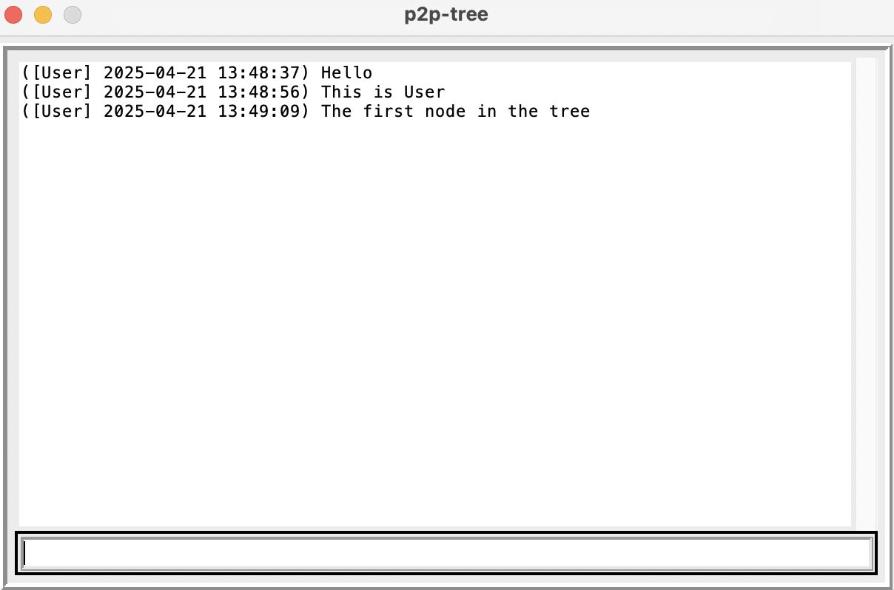

# p2p-tree

This is a peer-to-peer (P2P) group message application based on TCP.
Group members are "nodes" where every node is an instance
of the program (`node.py`) and acts as both server and client.
Groups are formed by invitations and each member only maintains
connections with its invited members and the member that invited it.
The first member of a group has no inviter.
A group's topology is a tree and messages are relayed by nodes on the tree.
The following picture depicts the GUI on macOS where the tree contains only
one node (so the output panel shows the messages sent by the node itself).

## usage

There are two modes of usage: GUI and CLI.
GUI supports one-line messages (including empty lines)
while CLI only supports non-empty one-line messages
because empty lines are used to signal termination.
The encoded line (including a header) must not exceed 128 bytes,
otherwise only the first 128 bytes will be relayed.

Run `python3 node.py` to see the usage (command line arguments).
See `test.py` for multi-node examples.

## tests

`python3 test.py`

## dependency

+ Python >= 3.10
+ IPv4 (it should be easy to change it to IPv6 or both)

## packets

Packets (over TCP) are of fixed-length (128 bytes).

## stability

The disconnection of one node may split the group (tree)
into multiple smaller groups.

## TODOs

Encryption and NAT hole punching are currently not supported.
